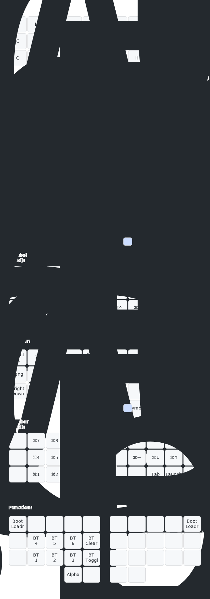

[Canary layout](https://github.com/Apsu/Canary) on a [Ferris Sweep](https://github.com/davidphilipbarr/Sweep) using Kailh pink choc switches

## 232 chords

### Symbols
- `e` + `.` → !
- `i` + `,` → ?
- `a` + `ret` → :
- `a` + `'` → ;
- `&` + `—` → ¢
- `*` + `@` → £
- `=` + `_` → ¥
- `(` + `[` → €
- `<` + `…` → ⋯
- `{` + `(` → •
- `\` + `=` → °
- `` ` `` + `&` → ∞
- `}` + `)` → ✔
- `)` + `]` → ✗
### Suffixes
- `i` + `n` + `g` → ⌫ing
- `n` + `'` + `t` → ⌫n't
- `'` + `v` + `e` → ⌫'ve
- `'` + `r` + `e` → ⌫'re
### Top 200 words
- `a` + `␣` → a
- `a` + `⌫` → A
- `i` + `␣` → I
- `b` + `e` + `␣` → be
- `o` + `f` + `␣` → of
- `t` + `o` + `␣` → to
- `i` + `n` + `␣` → in
- `h` + `e` + `␣` → he
- `i` + `t` + `␣` → it
- `a` + `s` + `␣` → as
- `o` + `n` + `␣` → on
- `a` + `t` + `␣` → at
- `b` + `y` + `␣` → by
- `w` + `e` + `␣` → we
- `d` + `o` + `␣` → do
- `o` + `r` + `␣` → or
- `i` + `f` + `␣` → if
- `n` + `e` + `␣` → no
- `s` + `o` + `␣` → so
- `u` + `p` + `␣` → up
- `g` + `o` + `␣` → go
- `t` + `h` + `e` → the
- `a` + `n` + `d` → and
- `f` + `o` + `r` → for
- `n` + `o` + `t` → not
- `s` + `h` + `e` → she
- `y` + `o` + `u` → you
- `z` + `u` + `t` → but
- `o` + `n` + `e` → one
- `a` + `l` + `x` → all
- `s` + `a` + `y` → say
- `w` + `h` + `o` → who
- `c` + `a` + `n` → can
- `k` + `a` + `n` → man
- `o` + `u` + `t` → out
- `n` + `e` + `w` → new
- `s` + `e` + `k` → see
- `u` + `s` + `e` → use
- `g` + `e` + `t` → get
- `a` + `n` + `y` → any
- `n` + `o` + `w` → now
- `m` + `a` + `y` → may
- `d` + `a` + `y` → day
- `w` + `a` + `y` → way
- `o` + `w` + `f` → own
- `h` + `o` + `u` → how
- `t` + `o` + `f` → too
- `o` + `l` + `d` → old
- `o` + `f` + `k` → off
- `f` + `e` + `w` → few
- `a` + `s` + `k` → ask
- `e` + `n` + `d` → end
- `s` + `e` + `t` → set
- `e` + `y` + `x` → eye
- `r` + `u` + `n` → run
- `h` + `a` + `v` → have
- `t` + `h` + `a` → that
- `t` + `h` + `y` → they
- `w` + `i` + `h` → with
- `t` + `h` + `s` → this
- `r` + `o` + `m` → from
- `w` + `i` + `l` → will
- `m` + `a` + `k` → make
- `w` + `h` + `e` → when
- `m` + `r` + `e` → more
- `w` + `h` + `t` → what
- `t` + `m` + `e` → time
- `t` + `a` + `n` → than
- `i` + `n` + `o` → into
- `o` + `l` + `y` → only
- `y` + `e` + `a` → year
- `s` + `o` + `m` → some
- `a` + `k` + `e` → take
- `c` + `o` + `m` → come
- `k` + `n` + `o` → know
- `l` + `i` + `k` → like
- `t` + `e` + `n` → then
- `o` + `r` + `k` → work
- `s` + `c` + `h` → such
- `g` + `i` + `v` → give
- `o` + `v` + `r` → over
- `m` + `o` + `t` → most
- `e` + `v` + `n` → even
- `f` + `i` + `d` → find
- `a` + `l` + `o` → also
- `m` + `n` + `y` → many
- `m` + `u` + `t` → must
- `l` + `o` + `k` → look
- `b` + `a` + `c` → back
- `l` + `o` + `n` → long
- `m` + `u` + `c` → much
- `w` + `e` + `l` → well
- `d` + `w` + `n` → down
- `u` + `s` + `t` → just
- `v` + `o` + `d` → good
- `a` + `c` + `h` → each
- `f` + `e` + `l` → feel
- `s` + `e` + `m` → seem
- `h` + `i` + `g` → high
- `v` + `e` + `r` → very
- `h` + `n` + `d` → hand
- `l` + `i` + `f` → life
- `t` + `e` + `l` → tell
- `j` + `h` + `e` → here
- `s` + `h` + `w` → show
- `b` + `o` + `h` → both
- `t` + `n` + `d` → need
- `m` + `e` + `a` → mean
- `c` + `a` + `l` → call
- `l` + `a` + `s` → last
- `m` + `v` + `e` → move
- `s` + `a` + `m` → same
- `p` + `a` + `r` → part
- `t` + `u` + `n` → turn
- `e` + `a` + `l` → real
- `w` + `a` + `t` → want
- `z` + `o` + `r` → form
- `l` + `a` + `t` → late
- `g` + `m` + `e` → home
- `o` + `p` + `n` → open
- `h` + `o` + `d` → hold
- `h` + `e` + `d` → head
- `w` + `r` + `d` → word
- `e` + `a` + `d` → lead
- `p` + `l` + `n` → plan
- `k` + `e` + `x` → keep
- `f` + `a` + `c` → face
- `f` + `c` + `t` → fact
- `p` + `l` + `y` → play
- `h` + `l` + `p` → help
- `l` + `n` + `e` → line
- `h` + `i` + `c` → which
- `w` + `o` + `u` → would
- `t` + `h` + `r` → there
- `o` + `t` + `r` → other
- `b` + `o` + `u` → about
- `c` + `o` + `u` → could
- `s` + `t` + `a` → state
- `n` + `h` + `s` → these
- `f` + `r` + `s` → first
- `h` + `i` + `k` → think
- `f` + `t` + `r` → after
- `g` + `r` + `e` → great
- `w` + `h` + `r` → where
- `t` + `o` + `s` → those
- `p` + `c` + `e` → place
- `w` + `l` + `d` → world
- `s` + `t` + `l` → still
- `r` + `i` + `e` → write
- `h` + `o` + `s` → house
- `u` + `n` + `d` → under
- `r` + `i` + `t` → right
- `t` + `i` + `n` → thing
- `n` + `v` + `r` → never
- `e` + `g` + `i` → begin
- `h` + `i` + `e` → while
- `e` + `a` + `v` → leave
- `m` + `i` + `t` → might
- `p` + `o` + `i` → point
- `c` + `i` + `d` → child
- `m` + `a` + `l` → small
- `s` + `i` + `e` → since
- `a` + `r` + `g` → large
- `a` + `g` + `i` → again
- `o` + `r` + `d` → order
- `g` + `o` + `u` → group
- `s` + `n` + `d` → stand
- `e` + `l` + `y` → early
- `b` + `f` + `o` → before
- `s` + `o` + `u` → should
- `p` + `e` + `l` → people
- `l` + `i` + `t` → little
- `n` + `a` + `i` → nation
- `c` + `m` + `e` → become
- `s` + `h` + `l` → school
- `n` + `e` + `r` → number
- `p` + `s` + `n` → person
- `p` + `l` + `i` → public
- `f` + `o` + `l` → follow
- `d` + `r` + `n` → during
- `g` + `r` + `n` → govern
- `a` + `r` + `d` → around
- `s` + `t` + `m` → system
- `o` + `r` + `s` → course
- `c` + `h` + `e` → change
- `h` + `r` + `g` → through
- `b` + `e` + `a` → because
- `b` + `e` + `n` → between
- `d` + `e` + `v` → develop
- `g` + `e` + `n` → general
- `a` + `h` + `r` → another
- `a` + `g` + `n` → against
- `r` + `n` + `t` → present
- `i` + `t` + `o` → without
- `r` + `g` + `m` → program
- `l` + `e` + `m` → problem
- `h` + `e` + `v` → however
- `i` + `n` + `r` → interest
- `p` + `s` + `e` → possible
- `c` + `n` + `d` → consider
- `i` + `n` + `c` → increase
### Top 1000 words (todo)
- `h` + `e` + `r` → her
- `h` + `a` + `d` → had
- `s` + `e` + `a` → sea
- `t` + `r` + `u` → true
- `l` + `i` + `e` → lie
- `h` + `a` + `k` → thank
### Other common words
- `h` + `e` + `y` → hey
- `r` + `e` + `t` → return
- `p` + `b` + `l` + `y` → probably
- `t` + `a` + `y` → thank you
- `t` + `n` + `s` → thanks
### Misc phrases
- `b` + `q` + `x` + `'` → the quick brown fox jumps over the lazy dog
- `e` + `l` + `b` + `h` → Elbereth
