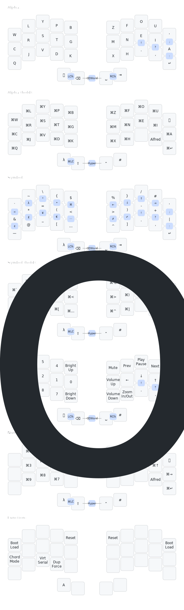

- [Keyboard hardware](https://github.com/sartak/Sweep)
- [ZMK config](https://github.com/sartak/zmk-config)
- [QMK config](https://github.com/sartak/qmk-config)
- [xKeyboard (iOS) config](https://github.com/sartak/xkeyboard-config)

## Overview

I use the [Canary layout](https://github.com/Apsu/Canary) on a lightly-modded [Ferris Sweep](https://github.com/sartak/Sweep) with Kailh chocs. I use the lightest switches I can find, currently pinks (linear, which I modded to lighter, 15gf springs).

I do a lot of programming in vim. For gaming, I… use other devices, so I'm happy to tradeoff a little bit of input latency (&lt;100ms, even in the worst case) for keyboard superpowers.

## Chording

I use chords heavily to type entire words (see below!), inspired by [Plover steno](https://www.openstenoproject.org/plover/) and [CharaChorder](https://www.charachorder.com). For example, combo'ing `c+n+d` together types the word `consider`, along with a trailing space.

Either holding shift, or adding shift to the combo, will output the chord with the first letter capitalized. That's the default; each chord can customize whether to take that default, disable shifting entirely (e.g. the chord that outputs `https://` _never_ emits `Https://`, yuck), or provide some completely different behavior (e.g. if I were living in Paris, maybe a chord for `champs-elysees` gets shifted to `Champs-Élysées`).

Chording a word also makes the following punctuation smarter. For example typing a `.` will delete the chord's trailing space, add the period then a new trailing space, and turn on sticky shift for the next letter (or the aforementioned shifting for chords). Typing `,` is similar but doesn't enable the shifting behavior.

Instead of outputting words with trailing spaces, chords can define arbitrary behavior as well. They can turn on oneshot mods or oneshot layers, click with left or right mouse button, etc.

One such behavior is `delete-word`. Given that this keyboard is designed around chording entire words, deleting words becomes a much more common operation. Comboing space+backspace sends alt+backspace to delete the preceding word. And as a special case, comboing space+backspace immediately after a chord deletes that chord's output. This makes it more like an "undo chord" rather than delete word. This better matches intent when a chord emitted multiple words, or was not separated from the previous text by a space (such as in a long identifier name in code).

## Duplicate key

I have a duplicate key (`⨧`) on a thumb which enables a bunch of functionality. On its own, it repeats the previous keystroke. (If you know vim, think of it like the `.` command for your keyboard). When typing a word like "success", it's quicker to hit the dup key than to repeatedly use the same finger to type the double letters. That seems esoteric, but, given a reasonable corpus of English text, a distinct dup key is higher frequency than half the alphabet (including letters like `p` and `c`). I also have an (optional) way to forbid typing double letters the usual way, to force you to build the muscle memory for the dup key. dup even on its own will also repeat any modifiers, which makes a lot of keyboard shortcuts easier to manage.

The dup key interacts with the chording system in two separate ways. One, it's a valid input into chords. This opens up the namespace of manageable combos, especially for short anagrams. For example, `who` is `w+h+o`, but that takes the combo from `how`. Having dup means `how` can at least get `h+w+⨧` rather than adding some unrelated letter. Second, tapping dup on its own immediately after a chord will cycle through alternate, predefined expansions. For example, chording `t+n+s` emits `thanks ` (with a trailing space). If I then tap dup, it will backspace twice to remove the trailing space and the last letter `s`, then emit `you` to produce the final result of `thank you `. Tapping dup again will delete both words then emit `Thank you very much!`. Finally tapping dup again will cycle back to the first version, `thanks `. My own convention is that dupping a noun will pluralize it, dupping a verb will cycle tenses (`become`, `became`, `becoming`), dupping an adjective (`new`) will include comparatives (`newer`) and superlatives (`newest`). It's all driven by user-defined data, so there are no hard rules.

Tapping dup after a behavior chord repeat it, though that can be customized per-behavior as well.

## Sidechannel

My keyboard also emits a sidechannel of keys pressed and chords used. (Astute readers will recognize this as a _keylogger_!) Ordinarily, the host computer can only see the outputs of chords; this allows seeing the inputs too. I have a daemon listening to that sidechannel to track whether each word was typed using character entry or a chord. This unlocks some neat benefits, like noticing I type a word the slow way frequently, and either remind me of the chord I already have for it, or offer up an available combo. It also offers a more accurate visualization of where my fingers are on the keyboard, which I can iframe into a website like Monkeytype like so:

## Modifiers

For modifiers, I choose to not use homerow mods since they wouldn't work well with word-chords. Instead, I hold a letter, symbol, or number key for just an extra moment (200ms) to emit the ⌘-modified character. The space and backspace keys act as shift and ctrl when held with another key. Space and backspace also join together for hyper (which I use as an application switcher). For the very few uses of alt that I need, I have dedicated keys (a combo for alt-backspace to delete a word, a handful of characters on the symbol layer, etc).

Building off the feature for ⌘-modified character characters, each chord can have a custom behavior when held for 200ms. I added this not for words, but to extend the key layout. Tapping the left two thumb keys will emit a left click, but holding it will emit a ⌘-modified left clicke. Holding the two inner thumb keys will delete word when tapped, but turn on oneshot Hyper when held. As an example of where this is useful for "ordinary" chords, I have a chord that outputs my domain name `shawn.dev` on tap, or the full URL `https://shawn.dev/` when held. This combines with the custom shifting behavior so each chord can have four variants (base, shifted, held, held shifted), and each of those variants can have its own bespoke cycle of expansions with `⨧`.

## Keymap

_(generated by [caksoylar/keymap-drawer](https://github.com/caksoylar/keymap-drawer))_

## 453 chords

### Suffixes

- `i` + `n` + `g` → ⌫ing
- `n` + `'` + `t` → ⌫n't
- `'` + `v` + `e` → ⌫'ve
- `'` + `r` + `e` → ⌫'re

### Top 200 words

- `t` + `h` + `e` → the
- `b` + `e` + `⨧` → be
- `o` + `f` + `⨧` → of
- `a` + `n` + `d` → and
- `a` + `⨧` → a
- `a` + `⌫` → A
- `t` + `o` + `⨧` → to
- `i` + `n` + `⨧` → in
- `h` + `e` + `⨧` → he
- `h` + `a` + `v` → have → haves → had → having
- `i` + `t` + `⨧` → it → them
- `t` + `h` + `a` → that → those
- `f` + `o` + `r` → for
- `⨧` + `h` + `y` → they
- `i` + `⨧` → I → we
- `w` + `i` + `h` → with
- `a` + `s` + `⨧` → as
- `n` + `o` + `t` → not
- `o` + `n` + `⨧` → on
- `s` + `h` + `e` → she → they
- `a` + `t` + `⨧` → at
- `b` + `y` + `⨧` → by
- `t` + `h` + `s` → this → these
- `w` + `e` + `⨧` → we → I
- `y` + `o` + `u` → you → y'all
- `d` + `o` + `⨧` → do → does → did → doing
- `i` + `u` + `t` → but
- `⨧` + `o` + `m` → from
- `o` + `r` + `⨧` → or
- `h` + `i` + `c` → which
- `o` + `n` + `e` → one → ones
- `w` + `o` + `u` → would
- `a` + `l` + `⨧` → all
- `w` + `i` + `l` → will → wills → willed → willing
- `t` + `h` + `r` → there
- `s` + `a` + `y` → say → says → said → saying
- `w` + `h` + `o` → who → whom
- `m` + `a` + `k` → make → made → making
- `w` + `h` + `e` → when
- `c` + `a` + `n` → can
- `m` + `o` + `r` → more → most → many
- `i` + `f` + `⨧` → if
- `n` + `e` + `⨧` → no
- `m` + `a` + `n` → man → men
- `o` + `u` + `t` → out → outs → outed → outing
- `o` + `t` + `r` → other → others
- `s` + `o` + `⨧` → so
- `⨧` + `h` + `a` → what
- `t` + `m` + `e` → time → times
- `u` + `p` + `⨧` → up
- `g` + `o` + `⨧` → go → went → going
- `b` + `o` + `u` → about
- `t` + `a` + `n` → than
- `i` + `n` + `o` → into
- `c` + `o` + `u` → could
- `s` + `t` + `a` → state → states → stated → stating
- `o` + `l` + `y` → only
- `n` + `e` + `w` → new → newer → newest
- `y` + `e` + `a` → year → years
- `s` + `o` + `m` → some
- `a` + `k` + `e` → take → took → taking
- `c` + `o` + `m` → come → came → coming
- `n` + `h` + `s` → these → this
- `k` + `n` + `o` → know → knew → knowing
- `s` + `e` + `k` → see → saw → seeing
- `u` + `s` + `e` → use → used → using
- `g` + `e` + `t` → get → got → getting
- `i` + `e` + `⨧` → like → liked → liking
- `t` + `e` + `n` → then
- `f` + `r` + `s` → first → firsts
- `a` + `n` + `y` → any
- `o` + `r` + `k` → work → works → worked → working
- `n` + `o` + `w` → now
- `m` + `a` + `y` → may
- `s` + `c` + `h` → such
- `g` + `i` + `v` → give → gave → giving
- `o` + `v` + `r` → over
- `h` + `i` + `k` → think → thought → thinking
- `m` + `o` + `t` → most → many → more
- `e` + `v` + `n` → even
- `⨧` + `f` + `n` → find → found → finding
- `a` + `y` + `⨧` → day → days
- `a` + `l` + `o` → also
- `f` + `t` + `r` → after
- `w` + `a` + `c` → way → ways
- `m` + `n` + `y` → many → more → most
- `m` + `u` + `t` → must
- `l` + `o` + `k` → look → looked → looking
- `b` + `f` + `o` → before
- `g` + `r` + `e` → great → greater → greatest
- `b` + `a` + `c` → back → backs → backed → backing
- `h` + `r` + `g` → through
- `l` + `o` + `n` → long → longer → longest
- `⨧` + `e` + `r` → where
- `m` + `u` + `c` → much
- `s` + `o` + `u` → should
- `w` + `e` + `l` → well → wells
- `p` + `e` + `l` → people → peoples → person
- `⨧` + `d` + `n` → down
- `⨧` + `w` + `n` → own → owned → owning
- `u` + `s` + `t` → just
- `b` + `e` + `a` → because
- `v` + `o` + `d` → good → better → best
- `a` + `c` + `h` → each
- `t` + `o` + `s` → those → that
- `f` + `e` + `l` → feel → felt → feeling
- `s` + `e` + `m` → seem → seemed → seeming
- `h` + `o` + `u` → how
- `h` + `i` + `g` → high → higher → highest
- `t` + `o` + `f` → too
- `p` + `c` + `e` → place → places
- `l` + `i` + `t` → little → littler → littlest
- `o` + `r` + `l` → world → worlds
- `v` + `e` + `r` → very
- `s` + `t` + `l` → still
- `a` + `t` + `i` → nation → nations
- `h` + `n` + `d` → hand → hands
- `⨧` + `o` + `l` → old → older → oldest
- `l` + `i` + `f` → life → lives
- `t` + `e` + `l` → tell → told → telling
- `r` + `i` + `e` → write → wrote → writing
- `c` + `m` + `e` → become → became → becoming
- `h` + `r` + `⨧` → here
- `s` + `h` + `⨧` → show → showed → showing
- `o` + `s` + `e` → house → houses
- `⨧` + `t` + `h` → both
- `b` + `e` + `n` → between
- `t` + `n` + `d` → need → needed → needing
- `m` + `n` + `⨧` → mean → meant → meaning
- `⨧` + `c` + `a` → call → called → calling
- `d` + `e` + `v` → develop → developed → developing
- `u` + `n` + `d` → under
- `l` + `a` + `s` → last
- `r` + `i` + `t` → right → rights
- `m` + `v` + `e` → move → moved → moving
- `t` + `i` + `n` → thing → things
- `g` + `e` + `n` → general → generals
- `s` + `h` + `l` → school → schools
- `n` + `v` + `r` → never
- `s` + `a` + `m` → same
- `a` + `h` + `r` → another
- `e` + `g` + `i` → begin → began → beginning
- `h` + `i` + `e` → while
- `n` + `e` + `r` → number → numbers
- `p` + `a` + `r` → part → parts → parted → parting
- `t` + `u` + `n` → turn → turns → turned → turning
- `e` + `a` + `l` → real
- `e` + `a` + `v` → leave → left → leaving
- `m` + `i` + `t` → might
- `w` + `a` + `t` → want → wanted → wanting
- `p` + `o` + `i` → point → points → pointed → pointing
- `f` + `r` + `⨧` → form → forms → formed → forming
- `o` + `f` + `n` + `e` → off
- `c` + `i` + `d` → child → children
- `f` + `e` + `w` → few → fewer → fewest
- `m` + `a` + `l` → small → smaller → smallest
- `s` + `i` + `e` → since
- `a` + `g` + `n` → against
- `a` + `s` + `k` → ask → asked → asking
- `l` + `a` + `t` → late → later → latest
- `g` + `m` + `e` → home → homes → homed → homing
- `i` + `n` + `r` → interest → interests → interested → interesting
- `a` + `r` + `g` → large → larger → largest
- `p` + `s` + `n` → person → people
- `e` + `n` + `d` → end → ends → ended → ending
- `o` + `p` + `n` → open → opened → opening
- `p` + `l` + `i` → public
- `f` + `o` + `l` → follow → followed → following
- `d` + `r` + `n` → during
- `r` + `n` + `t` → present → presents → presented → presenting
- `i` + `t` + `o` → without
- `a` + `g` + `i` → again
- `h` + `d` + `⨧` → hold → held → holding
- `g` + `r` + `n` → govern → governed → governing
- `a` + `r` + `d` → around
- `p` + `s` + `e` → possible
- `h` + `e` + `d` → head → heads → headed → heading
- `c` + `n` + `d` → consider → considered → considering
- `⨧` + `r` + `d` → word → words → worded → wording
- `r` + `g` + `m` → program → programs → programmed → programming
- `l` + `e` + `m` → problem → problems
- `h` + `e` + `v` → however
- `e` + `a` + `d` → lead → leads → led → leading
- `s` + `y` + `t` → system → systems
- `s` + `e` + `t` → set → sets → setting
- `o` + `r` + `d` → order → orders → ordered → ordering
- `e` + `y` + `⨧` → eye → eyes → eyed → eyeing
- `p` + `l` + `n` → plan → plans → planned → planning
- `r` + `u` + `n` → run → runs → ran → running
- `e` + `p` + `⨧` → keep → keeps → kept → keeping
- `f` + `a` + `c` → face → faces → faced → facing
- `f` + `c` + `t` → fact → facts
- `g` + `o` + `u` → group → groups → grouped → grouping
- `p` + `l` + `y` → play → plays → played → playing
- `s` + `n` + `d` → stand → stands → stood → standing
- `i` + `n` + `c` → increase → increases → increased → increasing
- `e` + `l` + `y` → early → earlier → earliest
- `o` + `r` + `s` → course → courses
- `c` + `h` + `e` → change → changes → changed → changing
- `h` + `l` + `p` → help → helped → helping
- `l` + `n` + `e` → line → lines → lined → lining

### Top 1000 words (wip)

- `h` + `i` + `s` → his
- `h` + `e` + `r` → her
- `a` + `n` + `⨧` → an
- `m` + `y` + `⨧` → my → our
- `h` + `i` + `r` → their
- `m` + `e` + `⨧` → me → us
- `b` + `i` + `m` → him
- `y` + `o` + `r` → your
- `i` + `t` + `s` → its
- `t` + `w` + `o` → two
- `o` + `u` + `r` → our → my
- `u` + `s` + `⨧` → us
- `i` + `s` + `⨧` → is
- `w` + `a` + `s` → was
- `a` + `r` + `e` → are
- `h` + `a` + `d` → had
- `w` + `e` + `r` → were
- `s` + `a` + `i` → said
- `h` + `a` + `s` → has
- `s` + `u` + `d` → sound → sounds
- `w` + `t` + `r` → water → waters → watered → watering
- `s` + `i` + `d` → side → sides → sided → siding
- `m` + `d` + `e` → made
- `l` + `i` + `v` → live
- `o` + `u` + `d` → round → rounder → roundest
- `c` + `a` + `m` → came
- `e` + `r` + `y` → every
- `n` + `a` + `e` → name → names → named → naming
- `s` + `e` + `n` → sentence → sentences
- `l` + `o` + `w` → low → lower → lowest
- `d` + `f` + `r` → differ
- `c` + `a` + `s` → cause → causes
- `b` + `o` + `y` → boy → boys
- `d` + `e` + `s` → does
- `a` + `i` + `r` → air → airs
- `p` + `u` + `t` → put
- `p` + `o` + `r` → port → ports
- `s` + `p` + `l` → spell → spells
- `l` + `n` + `d` → land → lands
- `b` + `i` + `g` → big → bigger → biggest
- `a` + `c` + `t` → act
- `w` + `h` + `y` → why
- `m` + `e` + `n` → men
- `w` + `n` + `t` → went
- `l` + `i` + `g` → light → lights → lighter → lightest
- `i` + `n` + `d` → kind → kinder → kindest
- `p` + `i` + `c` → picture → pictures
- `t` + `r` + `y` → try
- `a` + `n` + `l` → animal → animals
- `m` + `t` + `r` → mother → mothers
- `b` + `u` + `l` → build → builds
- `s` + `l` + `f` → self → selves
- `e` + `a` + `h` → earth → earths
- `f` + `a` + `e` → father → fathers
- `p` + `a` + `e` → page → pages
- `c` + `u` + `y` → country → countries
- `f` + `u` + `d` → found
- `a` + `n` + `s` → answer → answers
- `g` + `r` + `w` → grow
- `t` + `u` + `y` → study → studies
- `l` + `e` + `r` → learn
- `p` + `l` + `t` → plant → plants
- `c` + `o` + `v` → cover → covers
- `f` + `o` + `d` → food → foods
- `s` + `u` + `n` → sun → suns
- `f` + `o` + `u` → four → fours
- `t` + `h` + `u` → thought → thoughts
- `c` + `t` + `y` → city → cities
- `c` + `r` + `s` → cross → crosses
- `h` + `r` + `d` → hard → harder → hardest
- `f` + `a` + `r` → far → farther → farthest
- `s` + `e` + `a` → sea → seas
- `d` + `a` + `w` → draw
- `l` + `f` + `t` → left
- `p` + `r` + `s` → press → presses
- `c` + `o` + `s` → close → closer → closest
- `n` + `g` + `h` → night → nights
- `n` + `r` + `h` → north
- `o` + `g` + `h` → together
- `e` + `x` + `t` → next
- `w` + `i` + `e` → white → whiter → whitest
- `h` + `i` + `d` → children → child
- `g` + `o` + `t` → got
- `w` + `a` + `⨧` → walk → walks
- `m` + `p` + `l` → example → examples
- `l` + `w` + `y` → always
- `m` + `s` + `c` → music
- `m` + `r` + `k` → mark → marks
- `o` + `t` + `e` → often
- `l` + `t` + `r` → letter → letters
- `n` + `t` + `l` → until
- `m` + `i` + `e` → mile → miles
- `r` + `i` + `v` → river → rivers
- `c` + `a` + `r` → car → cars
- `f` + `e` + `t` → feet
- `c` + `r` + `e` → care
- `s` + `e` + `c` → second → seconds
- `c` + `a` + `y` → carry
- `s` + `c` + `i` → science → sciences
- `e` + `a` + `t` → eat
- `r` + `i` + `d` → friend → friends
- `b` + `g` + `n` → began
- `i` + `d` + `a` → idea → ideas
- `f` + `i` + `s` → fish → fishes
- `o` + `a` + `t` → mountain → mountains
- `s` + `t` + `p` → stop → stops
- `n` + `c` + `e` → once
- `b` + `a` + `s` → base → bases
- `h` + `r` + `s` → horse → horses
- `c` + `u` + `t` → cut → cuts
- `s` + `u` + `r` → sure
- `w` + `a` + `h` → watch → watches
- `c` + `o` + `r` → color → colors
- `w` + `o` + `d` → wood → woods
- `m` + `i` + `n` → main → mains
- `n` + `o` + `g` → enough
- `p` + `a` + `i` → plain → plainer → plainest
- `g` + `i` + `r` → girl → girls
- `u` + `s` + `l` → usual
- `y` + `o` + `g` → young → younger → youngest
- `e` + `d` + `y` → ready → readier → readiest
- `a` + `b` + `v` → above
- `r` + `e` + `d` → red → reds → redder → reddest
- `l` + `i` + `s` → list → lists
- `h` + `u` + `g` → though
- `b` + `i` + `r` → bird → birds
- `o` + `d` + `y` → body → bodies
- `f` + `a` + `y` → family → families
- `d` + `r` + `c` → direct
- `p` + `o` + `s` → pose
- `s` + `n` + `g` → song → songs
- `a` + `s` + `u` → measure → measures
- `r` + `d` + `u` → product → products
- `b` + `l` + `c` → black → blacks → blacker → blackest
- `h` + `o` + `r` → short → shorter → shortest
- `u` + `m` + `a` → numeral → numerals
- `c` + `l` + `s` → class → classes
- `w` + `i` + `d` → wind → winds
- `q` + `e` + `n` → question → questions
- `h` + `a` + `p` → happen
- `c` + `m` + `t` → complete
- `s` + `h` + `p` → ship → ships
- `h` + `a` + `l` → half → halves
- `r` + `c` + `k` → rock → rocks
- `f` + `i` + `r` → fire → fires
- `s` + `u` + `h` → south
- `t` + `l` + `d` → told
- `k` + `n` + `e` → knew
- `p` + `a` + `s` → pass → passes
- `t` + `o` + `p` → top → tops
- `w` + `h` + `l` → whole
- `s` + `p` + `c` → space → spaces
- `b` + `e` + `s` → best
- `h` + `u` + `r` → hour → hours
- `b` + `e` + `r` → better
- `t` + `r` + `u` → true → truer → truest
- `h` + `u` + `e` → hundred → hundreds
- `f` + `i` + `v` → five → fives
- `s` + `i` + `x` → six → sixes
- `w` + `a` + `r` → war → wars
- `l` + `a` + `y` → lay
- `m` + `a` + `p` → map → maps
- `f` + `l` + `y` → fly → flies
- `f` + `a` + `l` → fall → falls
- `c` + `r` + `y` → cry
- `b` + `o` + `x` → box → boxes
- `n` + `o` + `u` → noun → nouns
- `w` + `e` + `k` → week → weeks
- `o` + `h` + `⨧` → oh
- `f` + `r` + `e` → free
- `d` + `r` + `y` → dry → dryer → dryest
- `a` + `g` + `o` → ago
- `r` + `a` + `n` → ran
- `h` + `o` + `t` → hot → hots
- `b` + `a` + `l` → ball → balls
- `y` + `e` + `t` → yet
- `a` + `m` + `⨧` → am
- `a` + `r` + `m` → arm → arms
- `i` + `c` + `e` → ice → ices
- `m` + `a` + `t` → matter → matters
- `a` + `r` + `t` → art → arts
- `c` + `e` + `l` → cell → cells
- `s` + `m` + `r` → summer → summers
- `l` + `e` + `g` → leg → legs
- `j` + `o` + `y` → joy → joys
- `j` + `o` + `b` → job → jobs
- `g` + `a` + `s` → gas → gasses
- `b` + `u` + `y` → buy → buys
- `c` + `o` + `k` → cook → cooks
- `h` + `i` + `l` → hill → hills
- `l` + `a` + `w` → law → laws
- `l` + `i` + `e` → lie → lies
- `s` + `o` + `n` → son → sons
- `p` + `a` + `y` → pay
- `a` + `g` + `e` → age → ages
- `c` + `o` + `l` → cool → cooler → coolest
- `l` + `o` + `t` → lot → lots
- `k` + `e` + `y` → key → keys
- `r` + `o` + `w` → row → rows
- `d` + `i` + `e` → die → dies
- `o` + `i` + `l` → oil → oils
- `f` + `i` + `t` → fit → fits
- `h` + `i` + `t` → hit → hits
- `r` + `u` + `b` → rub → rubs
- `t` + `i` + `e` → tie → ties
- `g` + `u` + `n` → gun → guns
- `n` + `i` + `e` → nine → nines
- `h` + `a` + `k` → thank
- `e` + `x` + `p` → experience → experiences
- `l` + `e` + `d` → led
- `w` + `i` + `n` → win → wins
- `f` + `e` + `d` → feed → feeds
- `n` + `o` + `r` → nor
- `f` + `a` + `t` → fat → fats
- `b` + `a` + `r` → bar → bars
- `l` + `o` + `g` → log → logs

### Other common words

- `h` + `e` + `y` → hey
- `r` + `e` + `t` → return → returns → returned → will return
- `p` + `b` + `l` + `y` → probably
- `t` + `n` + `s` → thanks → thank you → Thanks very much!
- `i` + `v` + `e` → I've
- `p` + `e` + `r` → per
- `n` + `u` + `l` → null → nulls
- `n` + `i` + `l` → nil → nils
- `a` + `r` + `y` → array → arrays
- `s` + `r` + `t` → sort → sorts → sorted → will sort

### Common pairs of words

- `i` + `n` + `t` + `e` → in the
- `o` + `t` + `e` + `⨧` → of the
- `o` + `b` + `e` + `⨧` → to be
- `t` + `h` + `e` + `⨧` → to the
- `a` + `n` + `t` + `h` → and the
- `a` + `n` + `d` + `i` → and I
- `o` + `n` + `h` + `e` → on the
- `i` + `t` + `s` + `⨧` → it is
- `f` + `y` + `o` + `u` → if you
- `t` + `h` + `e` + `w` → the world
- `i` + `n` + `a` + `⨧` → in a
- `o` + `f` + `c` → of course

### Misc phrases

- `b` + `q` + `x` + `'` → the quick brown fox jumps over the lazy dog (shifted: The quick brown fox jumps over the lazy dog.)
- `e` + `l` + `b` + `h` → Elbereth
- `h` + `t` + `p` → https:// → http://
- `s` + `t` + `f` + `r` → select \* from (shifted: SELECT \* FROM)
- `p` + `o` + `m` + `n` → pokemon (shifted: Pokémon)
- `g` + `a` + `h` + `l` → graphql (shifted: GraphQL)
- `k` + `e` + `n` + `s` → kubernetes
- `c` + `o` + `d` + `e` → \`\`\`↵↵\`\`\`\<Up\>
- `t` + `s` + `o` + `e` → \`\`\`typescript↵↵\`\`\`\<Up\>
- `g` + `l` + `o` + `e` → \`\`\`go↵↵\`\`\`\<Up\>
