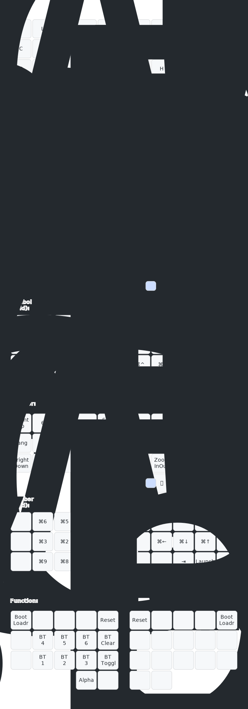

- [Keyboard hardware](https://github.com/sartak/Sweep)
- [ZMK config](https://github.com/sartak/zmk-config)
- [QMK config](https://github.com/sartak/qmk-config)
- [xKeyboard (iOS) config](https://github.com/sartak/xkeyboard-config)

I use the [Canary layout](https://github.com/Apsu/Canary) on a lightly-modded [Ferris Sweep](https://github.com/sartak/Sweep) with Kailh chocs. I use the lightest switches I can find, currently pinks (linear, which I modded to lighter, 15gf springs).

I do a lot of programming in vim. For gaming, I… use other devices, so I'm happy to tradeoff a little bit of input latency (&lt;100ms, even in the worst case) for keyboard superpowers.

I use chords heavily to type entire words (see below!), inspired by steno. For example, combo'ing `c+n+d` together types the word `consider`, along with a trailing space.

Chording a word also makes the following punctuation smarter. For example typing a `.` will delete the chord's trailing space, add the period then a new trailing space, and turn on sticky shift for the next letter. Typing `,` is similar but doesn't enable the sticky shift. I achieve this with a "sentence" layer that most chords enable and most other characters disable.

I have a duplicate key (`⨧`) on a thumb which enables a bunch of functionality. On its own, it repeats the previous keystroke. (If you know vim, think of it like the `.` command for your keyboard). When typing a word like "success", it's quicker to hit the dup key than to repeatedly use the same finger to type the double letters. That seems esoteric, but, given a reasonable corpus of English text, a distinct dup key is higher frequency than half the alphabet (including letters like `p` and `c`). I also have an (optional) way to forbid typing double letters the usual way, to force you to build the muscle memory for the dup key. dup even on its own will also repeat any modifiers, which makes a lot of keyboard shortcuts easier to manage.

The dup key interacts with the chording system in two separate ways. One, it's a valid input into chords. This opens up the namespace of manageable combos, especially for short anagrams. For example, `who` is `w+h+o`, but that takes the combo from `how`. Having dup means `how` can at least get `h+w+⨧` rather than adding some unrelated letter. Second, tapping dup on its own immediately after a chord will cycle through alternate, predefined expansions. For example, chording `t+n+s` emits `thanks ` (with a trailing space). If I then tap dup, it will backspace twice to remove the trailing space and the last letter `s`, then emit `you` to produce the final result of `thank you `. Tapping dup again will delete both words then emit `Thank you very much!`. Finally tapping dup again will cycle back to the first version, `thanks `. My own convention is that dupping a noun will pluralize it, dupping a verb will cycle between past; present; and future tenses, dupping an adjective (`new`) will include comparatives (`newer`) and superlatives (`newest`). It's all driven by user-defined data, so there are no hard rules.

My keyboard also emits a sidechannel of keys pressed and chords used. (Astute readers will recognize this as a _keylogger_!) Ordinarily, the host computer can only see the outputs of chords; this allows seeing the inputs too. I have a daemon listening to that sidechannel to track whether each word was typed using character entry or a chord. This unlocks some neat benefits, like noticing I type a word the slow way frequently, and either remind me of the chord I already have for it, or offer up an available combo. It also offers a more accurate visualization of where my fingers are on the keyboard, which I can iframe into a website like Monkeytype like so:

For modifiers, I choose to not use homerow mods since they wouldn't work well with word-chords. Instead, I hold a letter, symbol, or number key for just an extra moment (200ms) to emit the ⌘-modified character. The space and backspace keys act as shift and ctrl when held with another key. Space and backspace also join together for hyper (which I use as an application switcher). For the very few uses of alt that I need, I have dedicated keys (a combo for alt-backspace to delete a word, a handful of characters on the symbol layer, etc).

## 441 chords

### Suffixes

- `i` + `n` + `g` → ⌫ing
- `n` + `'` + `t` → ⌫n't
- `'` + `v` + `e` → ⌫'ve
- `'` + `r` + `e` → ⌫'re

### Top 200 words

- `t` + `h` + `e` → the
- `b` + `e` + `⨧` → be
- `o` + `f` + `⨧` → of
- `a` + `n` + `d` → and
- `a` + `⨧` → a
- `a` + `⌫` → A
- `t` + `o` + `⨧` → to
- `i` + `n` + `⨧` → in
- `h` + `e` + `⨧` → he
- `h` + `a` + `v` → have → had
- `i` + `t` + `⨧` → it → them
- `t` + `h` + `a` → that → those
- `f` + `o` + `r` → for
- `t` + `h` + `y` → they
- `i` + `⨧` → I → we
- `w` + `i` + `h` → with
- `a` + `s` + `⨧` → as
- `n` + `o` + `t` → not
- `o` + `n` + `⨧` → on
- `s` + `h` + `e` → she → they
- `a` + `t` + `⨧` → at
- `b` + `y` + `⨧` → by
- `t` + `h` + `s` → this → these
- `w` + `e` + `⨧` → we → I
- `y` + `o` + `u` → you
- `d` + `o` + `⨧` → do
- `i` + `u` + `t` → but
- `r` + `o` + `m` → from
- `o` + `r` + `⨧` → or
- `h` + `i` + `c` → which
- `o` + `n` + `e` → one
- `w` + `o` + `u` → would
- `a` + `l` + `x` → all
- `w` + `i` + `l` → will → wills
- `t` + `h` + `r` → there
- `s` + `a` + `y` → say → said
- `w` + `h` + `o` → who
- `m` + `a` + `k` → make → made → will make
- `w` + `h` + `e` → when
- `c` + `a` + `n` → can
- `m` + `r` + `e` → more → most → many
- `i` + `f` + `⨧` → if
- `n` + `e` + `⨧` → no
- `m` + `a` + `n` → man → men
- `o` + `u` + `t` → out → outs
- `o` + `t` + `r` → other → others
- `s` + `o` + `⨧` → so
- `w` + `h` + `t` → what
- `t` + `m` + `e` → time → times
- `u` + `p` + `⨧` → up
- `g` + `o` + `⨧` → go → went → will go
- `b` + `o` + `u` → about
- `t` + `a` + `n` → than
- `i` + `n` + `o` → into
- `c` + `o` + `u` → could
- `s` + `t` + `a` → state → states
- `o` + `l` + `y` → only
- `n` + `e` + `w` → new → newer → newest
- `y` + `e` + `a` → year → years
- `s` + `o` + `m` → some
- `a` + `k` + `e` → take → took → will take
- `c` + `o` + `m` → come → came → will come
- `n` + `h` + `s` → these
- `k` + `n` + `o` → know → knew → will know
- `s` + `e` + `k` → see → saw → will see
- `u` + `s` + `e` → use → used → will use
- `g` + `e` + `t` → get → got → will get
- `l` + `i` + `k` → like → liked → will like
- `t` + `e` + `n` → then
- `f` + `r` + `s` → first
- `a` + `n` + `y` → any
- `o` + `r` + `k` → work → worked → will work
- `n` + `o` + `w` → now
- `m` + `a` + `y` → may
- `s` + `c` + `h` → such
- `g` + `i` + `v` → give → gave → will give
- `o` + `v` + `r` → over
- `h` + `i` + `k` → think → thought → will think
- `m` + `o` + `t` → most → many → more
- `e` + `v` + `n` → even
- `f` + `i` + `d` → find → found → will find
- `d` + `a` + `y` → day → days
- `a` + `l` + `o` → also
- `f` + `t` + `r` → after
- `w` + `a` + `y` → way → ways
- `m` + `n` + `y` → many → more → most
- `m` + `u` + `t` → must
- `l` + `o` + `k` → look → looked → will looked
- `b` + `f` + `o` → before
- `g` + `r` + `e` → great → greater → greatest
- `b` + `a` + `c` → back → backs → backed → will back
- `h` + `r` + `g` → through
- `l` + `o` + `n` → long → longer → longest
- `w` + `h` + `r` → where
- `m` + `u` + `c` → much
- `s` + `o` + `u` → should
- `w` + `e` + `l` → well
- `p` + `e` + `l` → people → peoples → person
- `d` + `w` + `n` → down
- `o` + `w` + `f` → own → owned → will own
- `u` + `s` + `t` → just
- `b` + `e` + `a` → because
- `v` + `o` + `d` → good → better → best
- `a` + `c` + `h` → each
- `t` + `o` + `s` → those
- `f` + `e` + `l` → feel → felt → will feel
- `s` + `e` + `m` → seem → seemed → will seem
- `h` + `o` + `u` → how
- `h` + `i` + `g` → high → higher → highest
- `t` + `o` + `f` → too
- `p` + `c` + `e` → place → places
- `l` + `i` + `t` → little
- `w` + `l` + `d` → world → worlds
- `v` + `e` + `r` → very
- `s` + `t` + `l` → still
- `n` + `a` + `i` → nation → nations
- `h` + `n` + `d` → hand → hands
- `o` + `l` + `d` → old → older → oldest
- `l` + `i` + `f` → life → lives
- `t` + `e` + `l` → tell → told → will tell
- `r` + `i` + `e` → write → wrote → will write
- `c` + `m` + `e` → become → became → will become
- `j` + `h` + `e` → here
- `s` + `h` + `w` → show → showed → will show
- `h` + `o` + `s` → house → houses
- `b` + `o` + `h` → both
- `b` + `e` + `n` → between
- `t` + `n` + `d` → need → needed → will need
- `m` + `e` + `a` → mean → meant → will mean
- `c` + `a` + `l` → call → called → will call
- `d` + `e` + `v` → develop → developed → will develop
- `u` + `n` + `d` → under
- `l` + `a` + `s` → last
- `r` + `i` + `t` → right → rights
- `m` + `v` + `e` → move → moved → will move
- `t` + `i` + `n` → thing → things
- `g` + `e` + `n` → general → generals
- `s` + `h` + `l` → school → schools
- `n` + `v` + `r` → never
- `s` + `a` + `m` → same
- `a` + `h` + `r` → another
- `e` + `g` + `i` → begin → began → will begin
- `h` + `i` + `e` → while
- `n` + `e` + `r` → number → numbers
- `p` + `a` + `r` → part → parts → parted → will part
- `t` + `u` + `n` → turn → turns → turned → will turn
- `e` + `a` + `l` → real
- `e` + `a` + `v` → leave → left → will leave
- `m` + `i` + `t` → might
- `w` + `a` + `t` → want → wanted → will want
- `p` + `o` + `i` → point → points → pointed → will point
- `z` + `o` + `r` → form → forms → formed → will form
- `o` + `f` + `k` → off
- `c` + `i` + `d` → child → children
- `f` + `e` + `w` → few → fewer → fewest
- `m` + `a` + `l` → small → smaller → smallest
- `s` + `i` + `e` → since
- `a` + `g` + `n` → against
- `a` + `s` + `k` → ask → asked → will ask
- `l` + `a` + `t` → late → later → latest
- `g` + `m` + `e` → home → homes
- `i` + `n` + `r` → interest → interests → interested → will interest
- `a` + `r` + `g` → large → larger → largest
- `p` + `s` + `n` → person → people
- `e` + `n` + `d` → end → ends → ended → will end
- `o` + `p` + `n` → open → opened → will open
- `p` + `l` + `i` → public
- `f` + `o` + `l` → follow → followed → will follow
- `d` + `r` + `n` → during
- `r` + `n` + `t` → present → presents → presented → will present
- `i` + `t` + `o` → without
- `a` + `g` + `i` → again
- `h` + `o` + `d` → hold → held → will hold
- `g` + `r` + `n` → govern → governed → will govern
- `a` + `r` + `d` → around
- `p` + `s` + `e` → possible
- `h` + `e` + `d` → head → heads → headed → will head
- `c` + `n` + `d` → consider → considered → will consider
- `w` + `r` + `d` → word → words → worded → will word
- `r` + `g` + `m` → program → programs → programmed → will program
- `l` + `e` + `m` → problem → problems
- `h` + `e` + `v` → however
- `e` + `a` + `d` → lead → leads → led → will lead
- `s` + `t` + `m` → system → systems
- `s` + `e` + `t` → set → sets → will set
- `o` + `r` + `d` → order → orders → ordered → will order
- `e` + `y` + `x` → eye → eyes → eyed → will eye
- `p` + `l` + `n` → plan → plans → planned → will plan
- `r` + `u` + `n` → run → runs → ran → will run
- `k` + `e` + `x` → keep → kept → will keep
- `f` + `a` + `c` → face → faces → faced → will face
- `f` + `c` + `t` → fact → facts
- `g` + `o` + `u` → group → groups → grouped → will group
- `p` + `l` + `y` → play → plays → played → will play
- `s` + `n` + `d` → stand → stands → stood → will stand
- `i` + `n` + `c` → increase → increased → will increase
- `e` + `l` + `y` → early → earlier → earliest
- `o` + `r` + `s` → course → courses
- `c` + `h` + `e` → change → changes → changed → will change
- `h` + `l` + `p` → help → helped → will help
- `l` + `n` + `e` → line → lines

### Top 1000 words (wip)

- `h` + `i` + `s` → his
- `h` + `e` + `r` → her
- `a` + `n` + `⨧` → an
- `m` + `y` + `⨧` → my
- `h` + `i` + `r` → their
- `m` + `e` + `⨧` → me
- `b` + `i` + `m` → him
- `y` + `o` + `r` → your
- `i` + `t` + `s` → its
- `t` + `w` + `o` → two
- `o` + `u` + `r` → our
- `u` + `s` + `⨧` → us
- `i` + `s` + `⨧` → is
- `w` + `a` + `s` → was
- `a` + `r` + `e` → are
- `h` + `a` + `d` → had
- `w` + `e` + `r` → were
- `s` + `a` + `i` → said
- `h` + `a` + `s` → has
- `s` + `u` + `d` → sound
- `w` + `t` + `r` → water
- `s` + `i` + `d` → side
- `m` + `d` + `e` → made
- `l` + `i` + `v` → live
- `o` + `u` + `d` → round
- `c` + `a` + `m` → came
- `e` + `r` + `y` → every
- `n` + `a` + `e` → name
- `s` + `e` + `n` → sentence
- `l` + `o` + `w` → low
- `d` + `f` + `r` → differ
- `c` + `a` + `s` → cause
- `b` + `o` + `y` → boy
- `d` + `e` + `s` → does
- `a` + `i` + `r` → air
- `p` + `u` + `t` → put
- `p` + `o` + `r` → port
- `s` + `p` + `l` → spell
- `l` + `n` + `d` → land
- `b` + `i` + `g` → big
- `a` + `c` + `t` → act
- `w` + `h` + `y` → why
- `m` + `e` + `n` → men
- `w` + `n` + `t` → went
- `l` + `i` + `g` → light
- `i` + `n` + `d` → kind
- `p` + `i` + `c` → picture
- `t` + `r` + `y` → try
- `a` + `n` + `l` → animal
- `m` + `t` + `r` → mother
- `b` + `u` + `l` → build
- `s` + `l` + `f` → self
- `e` + `a` + `h` → earth
- `f` + `a` + `e` → father
- `p` + `a` + `e` → page
- `c` + `u` + `y` → country
- `f` + `u` + `d` → found
- `a` + `n` + `s` → answer
- `g` + `r` + `w` → grow
- `t` + `u` + `y` → study
- `l` + `e` + `r` → learn
- `p` + `l` + `t` → plant
- `c` + `o` + `v` → cover
- `f` + `o` + `d` → food
- `s` + `u` + `n` → sun
- `f` + `o` + `u` → four
- `t` + `h` + `u` → thought
- `c` + `t` + `y` → city
- `c` + `r` + `s` → cross
- `h` + `r` + `d` → hard
- `f` + `a` + `r` → far
- `s` + `e` + `a` → sea
- `d` + `a` + `w` → draw
- `l` + `f` + `t` → left
- `p` + `r` + `s` → press
- `c` + `o` + `s` → close
- `n` + `g` + `h` → night
- `n` + `r` + `h` → north
- `o` + `g` + `h` → together
- `e` + `x` + `t` → next
- `w` + `i` + `e` → white
- `h` + `i` + `d` → children
- `g` + `o` + `t` → got
- `a` + `l` + `k` → walk
- `m` + `p` + `l` → example
- `l` + `w` + `y` → always
- `m` + `s` + `c` → music
- `m` + `r` + `k` → mark
- `o` + `t` + `e` → often
- `l` + `t` + `r` → letter
- `n` + `t` + `l` → until
- `m` + `i` + `e` → mile
- `r` + `i` + `v` → river
- `c` + `a` + `r` → car
- `f` + `e` + `t` → feet
- `c` + `r` + `e` → care
- `s` + `e` + `c` → second
- `c` + `a` + `y` → carry
- `s` + `c` + `i` → science
- `e` + `a` + `t` → eat
- `r` + `i` + `d` → friend
- `b` + `g` + `n` → began
- `i` + `d` + `a` → idea
- `f` + `i` + `s` → fish
- `o` + `a` + `t` → mountain
- `s` + `t` + `p` → stop
- `n` + `c` + `e` → once
- `b` + `a` + `s` → base
- `h` + `r` + `s` → horse
- `c` + `u` + `t` → cut
- `s` + `u` + `r` → sure
- `w` + `a` + `h` → watch
- `c` + `o` + `r` → color
- `w` + `o` + `d` → wood
- `m` + `i` + `n` → main
- `n` + `o` + `g` → enough
- `p` + `a` + `i` → plain
- `g` + `i` + `r` → girl
- `u` + `s` + `l` → usual
- `y` + `o` + `g` → young
- `e` + `d` + `y` → ready
- `a` + `b` + `v` → above
- `r` + `e` + `d` → red
- `l` + `i` + `s` → list
- `h` + `u` + `g` → though
- `b` + `i` + `r` → bird
- `o` + `d` + `y` → body
- `f` + `a` + `y` → family
- `d` + `r` + `c` → direct
- `p` + `o` + `s` → pose
- `s` + `n` + `g` → song
- `a` + `s` + `u` → measure
- `r` + `d` + `u` → product
- `b` + `l` + `c` → black
- `h` + `o` + `r` → short
- `u` + `m` + `a` → numeral
- `c` + `l` + `s` → class
- `w` + `i` + `d` → wind
- `q` + `e` + `n` → question
- `h` + `a` + `p` → happen
- `c` + `m` + `t` → complete
- `s` + `h` + `p` → ship
- `h` + `a` + `l` → half
- `r` + `c` + `k` → rock
- `f` + `i` + `r` → fire
- `s` + `u` + `h` → south
- `t` + `l` + `d` → told
- `k` + `n` + `e` → knew
- `p` + `a` + `s` → pass
- `t` + `o` + `p` → top
- `w` + `h` + `l` → whole
- `s` + `p` + `c` → space
- `b` + `e` + `s` → best
- `h` + `u` + `r` → hour
- `b` + `e` + `r` → better
- `t` + `r` + `u` → true
- `h` + `u` + `e` → hundred
- `f` + `i` + `v` → five
- `s` + `i` + `x` → six
- `w` + `a` + `r` → war
- `l` + `a` + `y` → lay
- `m` + `a` + `p` → map
- `f` + `l` + `y` → fly
- `f` + `a` + `l` → fall
- `c` + `r` + `y` → cry
- `b` + `o` + `x` → box
- `n` + `o` + `u` → noun
- `w` + `e` + `k` → week
- `o` + `h` + `⨧` → oh
- `f` + `r` + `e` → free
- `d` + `r` + `y` → dry
- `a` + `g` + `o` → ago
- `r` + `a` + `n` → ran
- `h` + `o` + `t` → hot
- `b` + `a` + `l` → ball
- `y` + `e` + `t` → yet
- `a` + `m` + `⨧` → am
- `a` + `r` + `m` → arm
- `i` + `c` + `e` → ice
- `m` + `a` + `t` → matter
- `a` + `r` + `t` → art
- `c` + `e` + `l` → cell
- `s` + `m` + `r` → summer
- `l` + `e` + `g` → leg
- `j` + `o` + `y` → joy
- `j` + `o` + `b` → job
- `g` + `a` + `s` → gas
- `b` + `u` + `y` → buy
- `c` + `o` + `k` → cook
- `h` + `i` + `l` → hill
- `l` + `a` + `w` → law
- `l` + `i` + `e` → lie
- `s` + `o` + `n` → son
- `p` + `a` + `y` → pay
- `a` + `g` + `e` → age
- `c` + `o` + `l` → cool
- `l` + `o` + `t` → lot
- `k` + `e` + `y` → key
- `r` + `o` + `w` → row
- `d` + `i` + `e` → die
- `o` + `i` + `l` → oil
- `f` + `i` + `t` → fit
- `h` + `i` + `t` → hit
- `r` + `u` + `b` → rub
- `t` + `i` + `e` → tie
- `g` + `u` + `n` → gun
- `n` + `i` + `e` → nine
- `h` + `a` + `k` → thank
- `e` + `x` + `p` → experience
- `l` + `e` + `d` → led
- `w` + `i` + `n` → win
- `f` + `e` + `d` → feed
- `n` + `o` + `r` → nor
- `f` + `a` + `t` → fat
- `b` + `a` + `r` → bar
- `l` + `o` + `g` → log

### Other common words

- `h` + `e` + `y` → hey
- `r` + `e` + `t` → return
- `p` + `b` + `l` + `y` → probably
- `t` + `n` + `s` → thanks → thank you → Thanks very much!
- `i` + `v` + `e` → I've
- `p` + `e` + `r` → per
- `n` + `u` + `l` → null
- `n` + `i` + `l` → nil
- `a` + `r` + `y` → array
- `s` + `r` + `t` → sort

### Misc phrases

- `b` + `q` + `x` + `'` → the quick brown fox jumps over the lazy dog
- `e` + `l` + `b` + `h` → Elbereth
- `h` + `a` + `n` → Shawn → Shawn Moore
- `o` + `r` + `e` → Moore
- `s` + `a` + `r` → sartak
- `s` + `r` + `.` → sartak.org → https://sartak.org
- `h` + `n` + `.` → shawn.dev → https://shawn.dev
- `s` + `e` + `v` → Somerville
- `b` + `s` + `n` → Boston
- `c` + `h` + `u` → Massachusetts
